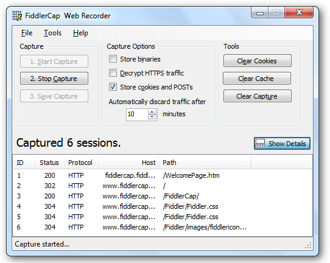

<!-- http://www.fiddlercap.com/FiddlerCap/ -->

---
title: Capturing Web Traffic Logs
slug: capturingwebtrafficlogs
tags: Web-Traffic
publish: true
---

#Capturing web traffic logs

##Introduction
If you've reached this page, chances are good that you were asked to capture a Web Traffic log.  Usually, this action is performed to track down a bug in your web browser or a website.

You can use FiddlerCap to capture your Web Traffic, and send that capture to a debugging buddy who can troubleshoot the bug. 

To get started, just follow the steps below.

##Step-by-step Instructions
1. Download [FiddlerCap](http://www.fiddlercap.com/dl/FiddlerCapSetup.exe). It's small and simple to install.
2. Close all instances of Internet Explorer. (Using Firefox? [click here](http://www.fiddlercap.com/fiddlercap/firefox.asp))
3. Install FiddlerCap by running the FiddlerCapSetup.exe file.
4. FiddlerCap will start automatically when the installer completes.
5. Unless your debugging buddy has asked you to skip this step: Inside FiddlerCap, click the **Clear Cookies** button and then the **Clear Cache** button.
6. Inside FiddlerCap, click the **1. Start Capture** button.
7. A new Internet Explorer window will appear. Use Internet Explorer's address bar to go to whatever site is having problems, and do whatever steps are needed to cause the problem to occur.
8. To add a picture of the screen to your capture, press the **+Screenshot** button inside FiddlerCap.
9. Inside FiddlerCap, click the **2. Stop Capture** button.
10 Click the **3. Save Capture** button.  Save the .SAZ file to your desktop.
11. Email the .SAZ file from your desktop to your debugging buddy.

If you have a problem performing any of these steps, contact your debugging buddy and tell them at which step there was a problem.  Be sure to communicate any error messages you encountered.

Note: If your debugging buddy indicates that you need to get a classic capture, please follow [these instructions](http://www.fiddler2.com/Fiddler/help/log_old.asp) instead.

Note: FiddlerCap's installer is only in English, but FiddlerCap itself will render in: English | Français | Español | Português | ??? | ??????? if supported by your Operating System.

##Screenshot
Here's a picture of the FiddlerCap user-interface while it's in "Capturing" mode.

##Comments? 
If you have a comment about the FiddlerCap tool, please click **Help > Send Feedback** inside FiddlerCap.