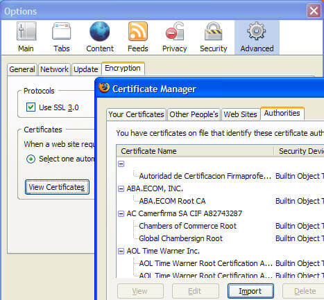

<!-- http://fiddler2.com/Fiddler/help/howto.asp -->

#Fiddler How-Tos

**Q:** How do I create a Session Archive Zip (SAZ) Traffic archive?  
**A:** Start Fiddler. Use your client or browser to generate some HTTP/HTTPS traffic. 

Click **File > Save > All Sessions...** and save the traffic to a .SAZ file.

**Q:** How do I see traffic to http://localhost or http://127.0.0.1?  
**A:** Read [this article](http://fiddler2.com/fiddler/help/hookup.asp#Q-LocalTraffic). Or upgrade to IE9.

**Q:** How do I configure Fiddler and IE9 to indicate why a given HTTP Request was made?  
**A:** Read this article.

[Enable Download-Initiator tagging.](https://www.fiddler2.com/dl/EnableDownloadInitiator.reg)

cols add @request.Accept
cols add @request.X-Download-Initiator

FiddlerObject.UI.lvSessions.AddBoundColumn("Accept", 50, "@request.Accept");  
FiddlerObject.UI.lvSessions.AddBoundColumn("Reason", 50, "@request.X-Download-Initiator"); 

**Q:** How do I see the HTTPS traffic-- I only see a "CONNECT" tunnel?  
**A:** HTTPS Traffic decryption is disabled by default. Learn more about [decrypting HTTPS traffic with Fiddler2.](http://fiddler2.com/fiddler/help/httpsdecryption.asp)

 

**Q:** How do I attach a client certificate?  
**A:** Fiddler 2.1.0.3 and later support client certificates.  See [Attaching Client Certificates](http://fiddler2.com/Fiddler/help/httpsclientcerts.asp) for more information.

 

**Q:** How do I configure my Windows client to trust the bogus root to avoid error messages and enable logon to services like Passport?  
**A:** This is not a recommended configuration.  You should never make this configuration change on a non-Test machine.

1. Visit a HTTPS site with Fiddler2 running, ensure that you see the Certificate Error warning page
2. START > RUN > CERTMGR.MSC
3. Drag the DO_NOT_TRUST_FiddlerRoot certificate to the Trusted Root Certification Authorities folder

  
You can make a similar configuration change for Firefox and other clients that do not use the Windows Certificate store; use the appropriate Options dialog in the browser.  
