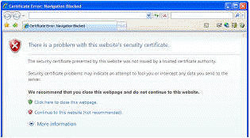
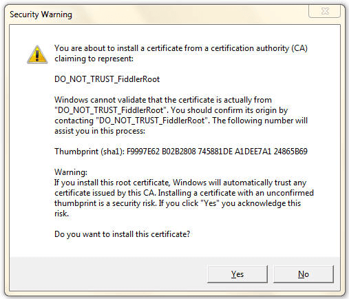
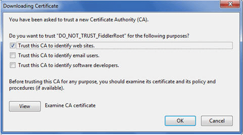

<!-- http://fiddler2.com/Fiddler/help/httpsdecryption.asp -->

#Decrypting HTTPS-protected traffic

##Introduction
Fiddler2 includes the ability to decrypt, view, and modify HTTPS-secured traffic for debugging purposes. The decryption feature is disabled by default; by default, the session list will show only a **CONNECT** tunnel through which the HTTPS-encrypted bytes flow.

Enable the traffic decryption option by clicking **Tools > Fiddler Options > HTTPS** and ticking the **Decrypt HTTPS Traffic** box.

##Frequently Asked Questions
**Q:** The HTTPS protocol was designed to prevent traffic viewing and tampering.  Given that, how can Fiddler2 debug HTTPS traffic?  
**A:** Fiddler2 relies on a "man-in-the-middle" approach to HTTPS interception.  To your web browser, Fiddler2 claims to be the secure web server, and to the web server, Fiddler2 mimics the web browser.  In order to pretend to be the web server, Fiddler2 dynamically generates a HTTPS certificate. 

Fiddler's certificate is not trusted by your web browser (since Fiddler is not a Trusted Root Certification authority), and hence while Fiddler2 is intercepting your traffic, you'll see a HTTPS error message in your browser, like so:

**Q:** Can I reconfigure my Windows client to trust the Fiddler root certificate to avoid error messages and enable logon to services like Passport?  
**A:** Yes.  I recommend that you only make this configuration change on Test-only machines.

1. When you tick the "Decrypt HTTPS Traffic" checkbox in Fiddler 2.2.9+, you will see the following prompt:  

2. If you click Yes, you will see the following prompt:  

 
3. If you click "Yes" then Windows will trust your Fiddler Root certificate and certificate warnings will be suppressed in any application which relies upon the Windows Certificate Store.

**Q:** How do I configure Firefox to trust the Fiddler root certificate?  
**A:** Open Fiddler 2.2.9+. Click Tools > Fiddler Options. Select the HTTPS tab, and click the **Export Fiddler Root Certificate to Desktop** button.

In Firefox, click **Tools > Options....** Click the Advanced button at the top. Click the **Encryption** tab. Click **View Certificates**. Click the **Authorities** tab. Click **Import.** Pick the .CER file from your desktop. Check the "Trust this CA to identify web sites" checkbox.

**Q:** I seem to always get an endless loop of 401 Errors when visiting an internal server when HTTPS Decryption is enabled?  
**A:** This may be related to the Extended Protection feature recently added to IIS. This feature binds authentication credentials to the HTTPS-channel; since Fiddler intercepts this channel, the credentials are no longer valid. See [this](http://blogs.msdn.com/b/fiddler/archive/2010/10/15/fiddler-https-decryption-and-channel-binding-token-authentication-problems.aspx) article for more information.

**Q:** Can Fiddler decrypt HTTPS traffic from a different machine?  
**A:** Yes, if you've [configured Fiddler to proxy traffic from a second computer or device](http://www.fiddler2.com/fiddler/help/hookup.asp#Q-NonWindows), you can decrypt that traffic, with two caveats:

1. If the client computer itself previously had run Fiddler in HTTPS-decryption mode, all attempts to visit HTTPS pages secured by the other computer's version of Fiddler will fail with an unspecified certificate problem. To resolve this, remove the Fiddler root certificate that is in the client's certificate store. (The mismatched root certificate causes the problem, as every Fiddler instance generates its own unique root).

2. If you want the client computer to trust the Fiddler certificate, you will have to copy or download the Fiddler Root certificate to the client computer and manually install it into the Trusted Root Certification Authorities store. In Fiddler 2.3.0.9+, you can download the Fiddler Root certificate by visiting using the URL: http://hostnameofFiddlerMachine:8888/FiddlerRoot.cer

**Q:** Can Fiddler intercept traffic from Apple iOS devices like **iPad/iPhone/iPod Touch** and **Android devices?**  
**A:** Yes, but these devices may not be compatible with the default certificates Fiddler generates.

To resolve the incompatibility, you may replace Fiddler's default certificate generator with one that generates certificates containing flags (e.g. AKID, SKID) that are compatible with these platforms. Simply download and install the new [Certificate Maker](http://fiddler2.com/dl/FiddlerCertMaker.exe) and restart Fiddler.

 

**Q:** Can Fiddler be configured to decrypt traffic only from certain hosts or processes?  
**A:** [Yes.](http://blogs.msdn.com/b/fiddler/archive/2010/10/15/fiddler-https-decryption-and-channel-binding-token-authentication-problems.aspx) You can do so by setting the **x-no-decrypt** flag on a given session. For instance, here's a bit of script that you can put inside OnBeforeRequest to prevent decryption of traffic to all hosts except a target host, 

    if (oSession.HTTPMethodIs("CONNECT") && 
        !oSession.HostnameIs("SiteICareAbout.com"))
    { oSession["x-no-decrypt"] = "do not care."; } 

or, in Fiddler 2.3.0.6 or later, you can do so by listing the hostname inside the text box Skip Decryption for the following hosts found by clicking Tools > Fiddler Options > HTTPS.

Alternatively, you could disable HTTPS-decryption for traffic from an entire application (e.g. boring.exe) using a rule like this inside OnBeforeRequest: 

	if (oSession.HTTPMethodIs("CONNECT") && oSession["X-PROCESSINFO"] && oSession["X-PROCESSINFO"].StartsWith("outlook")) 
	{ 
		oSession["x-no-decrypt"] = "boring process";
	}             

**Q:** Does Fiddler2 demonstrate a flaw in HTTPS?  
**A:** No. HTTPS relies on certificates in order to secure web traffic.  Web browsers prevent man-in-the-middle attacks by relying upon Trusted Root Certification authorities to issue certificates that secure the traffic.  As designed, web browsers will show a warning when traffic is not protected by a certificate issued by a trusted root.

**Q:** Does Fiddler2 support sites that require client certificates?  
**A:** Yes, Fiddler 2.1.0.3 and later support client certificates.  See [Attaching Client Certificates](http://fiddler2.com/Fiddler/help/httpsclientcerts.asp) for more information.

**Q:** Is Fiddler2 the only tool that debugs HTTPS traffic?  
**A:** No.  There are a number of other free tools which offer this capability, including the Charles and Burp proxies, written with Java.