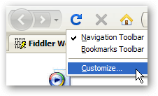
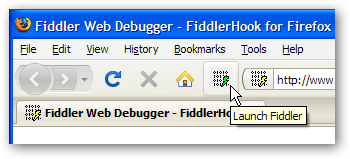
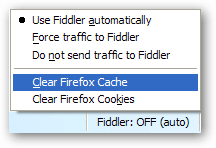

<!-- http://fiddler2.com/Fiddler2/addons/fiddlerhook/ -->

#FiddlerHook Help

##Introduction
The FiddlerHook Firefox addon points Firefox at Fiddler, avoiding the hassle of manual configuration or restarting Firefox.

##Usage Instructions
Click **Monitor with Fiddler** on Firefox's **Tools** menu (or in the status bar).  Choose an option to control how Firefox should use Fiddler.  
  
The option "Force Traffic to Fiddler" will attempt to send traffic to Fiddler regardless of whether or not it's even running. The Use Fiddler Automatically option will emulate IE's behavior: traffic will be sent to Fiddler only when Fiddler is running and is in "capturing" mode.

To add the **Launch Fiddler** button to your toolbar, right-click the Firefox toolbar and choose **Customize.**  

In the dialog that appears, drag the Fiddler icon to the toolbar location of your choice.  

FiddlerHook also introduces a simple way to clear your Firefox cache (memory and disk) and all cookies (persistent and session).  Simply click on the FiddlerHook status bar item and use the menu:  

Removal Instructions
You can use Firefox's Add-on Manager (on the tools menu) to disable the FiddlerHook addon.  If you would like to remove the FiddlerHook add-on altogether, you can simply delete the C:\Program Files\Fiddler2\FiddlerHook folder.
